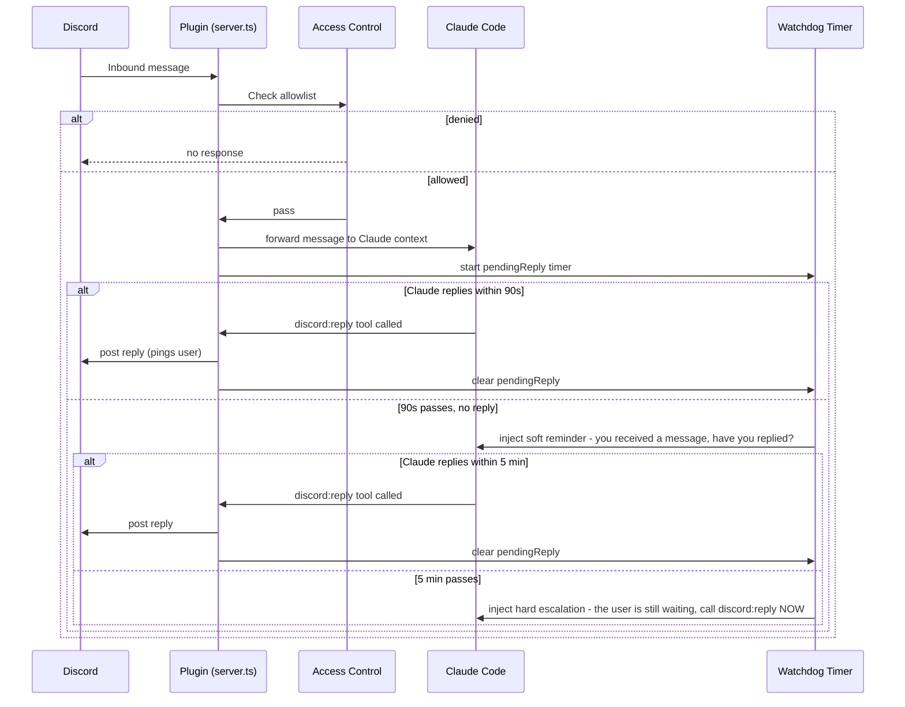
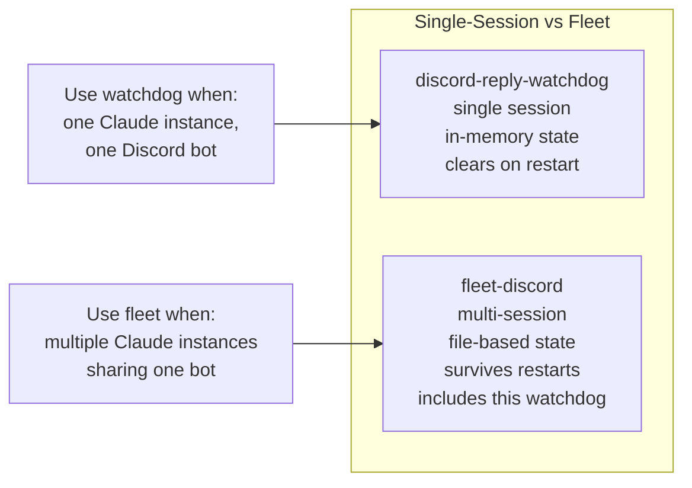

9e838d68e10be229e7f8df31879ceedef359eeab
# discord-reply-watchdog

A drop-in Discord channel plugin for Claude Code that adds one feature the stock plugin lacks: **a stuck-task watchdog** that reminds Claude to reply when it takes a Discord message but doesn't respond.


> Part of [The Agent Crafting Table](https://github.com/Agent-Crafting-Table) — standalone agent system components for Claude Code.

## How It Works





## The Problem

Claude Code wins a Discord message, starts working on it, and then... forgets to call `discord:reply`. The user sits waiting. No response, no error — just silence.

The watchdog fixes this with synthetic reminders injected directly into Claude's context:
- **90 seconds**: soft reminder — "you received a message, have you replied?"
- **5 minutes**: hard escalation — "the user is still waiting, call `discord:reply` now"

Reminders are cleared the moment `discord:reply` fires. If Claude replies in 89 seconds, nobody sees anything.

## Setup

This plugin is a drop-in replacement for the stock `claude-plugins-official/discord/server.ts`.

### 1. Clone and install

```bash
git clone https://github.com/Agent-Crafting-Table/discord-reply-watchdog.git
cd discord-reply-watchdog
bun install
```

### 2. Configure your Discord bot token

Same location the stock plugin uses:

```bash
mkdir -p ~/.claude/channels/discord
echo "DISCORD_BOT_TOKEN=your_token_here" > ~/.claude/channels/discord/.env
chmod 600 ~/.claude/channels/discord/.env
```

### 3. Point Claude Code at this plugin

In your `restart-loop.sh` or wherever you launch Claude, replace:

```bash
--channels plugin:discord@claude-plugins-official
```

with:

```bash
--channels plugin:discord@/path/to/discord-reply-watchdog
```

Or if the stock plugin is already installed, overwrite `server.ts` in its directory with the version from this repo. The interface is identical.

### 4. Configure watchdog timing (optional)

Set in `~/.claude/channels/discord/.env` or as environment variables:

| Variable | Default | Description |
|---|---|---|
| `WATCHDOG_REMIND_MS` | `90000` | Soft reminder threshold (90 seconds) |
| `WATCHDOG_ESCALATE_MS` | `300000` | Hard escalation threshold (5 minutes) |

```bash
# Faster reminders for a more responsive bot:
WATCHDOG_REMIND_MS=60000
WATCHDOG_ESCALATE_MS=180000
```

## Access Control

Identical to the stock Claude Code Discord plugin — managed via `/discord:access` in Claude's terminal:

```
/discord:access opt-in                           # generate pairing code
/discord:access pair <code>                      # pair from Discord DM
/discord:access allow YOUR_DISCORD_USER_ID       # allowlist yourself
/discord:access channel #channel --no-require-mention
```

## What This Is Not

This plugin is **single-session** — one Claude instance, one bot. It holds pending state in-memory, so a restart clears it (which is fine, because a restarting Claude is not responsible for the old reply).

For **multi-session fleets** — multiple Claude instances sharing one Discord bot with peer routing and busy isolation — use [fleet-discord](https://github.com/Agent-Crafting-Table/fleet-discord) instead. The fleet plugin includes this same watchdog, adapted to file-based state so it survives across sessions in a multi-instance environment.

## Requirements

- [Bun](https://bun.sh/) runtime
- Claude Code CLI (`@anthropic-ai/claude-code`)
- Discord bot token with Message Content Intent enabled

## File Structure

```
discord-reply-watchdog/
├── src/
│   └── server.ts     # the plugin — runs as an MCP server under bun
├── package.json
└── README.md
```

---
